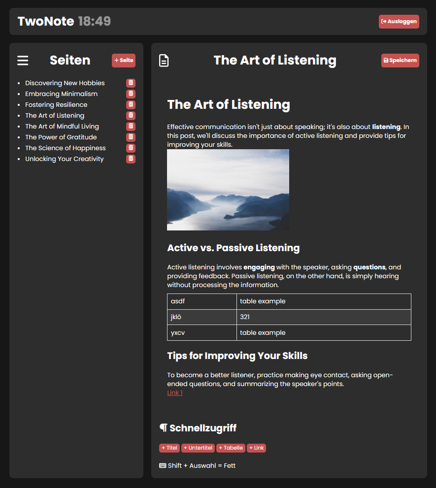

# TwoNote - A Simple OneNote Clone
Welcome to TwoNote, a simple and intuitive note-taking application inspired by OneNote, designed to keep your notes organized and easily accessible. Our application is built using Flask for the backend and plain HTML/CSS/JavaScript for the frontend, ensuring a lightweight and efficient experience.

### Why another OneNote clone?

My friends and I were in search of a straightforward note-sharing platform that didn't require a complex login procedure. Aiming for maximum simplicity, I developed this application in an afternoon. Please note, the entire interface is in German, but you're welcome to translate it into English.

## Getting Started
To get started with TwoNote, clone this repository to your local machine. Ensure you have Python and Flask installed to run the backend server, and any modern web browser to access the frontend interface.

### Prerequisites
- Python 3
- Flask

### Installation
1. Clone the repository to your local machine.
2. Navigate to the cloned directory.
3. Install Flask using pip if you haven't already:
```sh
pip install Flask
```
Start the Flask server:
```sh
python app.py
```
Open your web browser and go to http://localhost:21126 to access the TwoNote application.

## Features
- **Note Creation & Management:** Easily create new notes, edit existing ones, and organize your thoughts seamlessly.
- **Simple Text Formatting:** Use basic text formatting options like headings, bold text, and lists to structure your notes.
- **Password Protection:** Secure your notes with a password verification system to keep your information private.

## Screenshot of TwoNote
